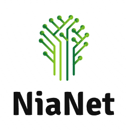

<p align="center"></p>

---
[](https://pypi.org/project/nianet/)

[](https://pepy.tech/project/nianet)
[](https://github.com/SasoPavlic/NiaNet/blob/main/LICENSE)
### Designing and constructing neural network topologies using nature-inspired algorithms

### Description 📝

The proposed method NiaNet attempts to pick hyperparameters and AE architecture that will result in a successful encoding and decoding (minimal difference between input and output). NiaNet uses the collection of algorithms available in the library [NiaPy](https://github.com/NiaOrg/NiaPy) to navigate efficiently in waste search-space.

### What it can do? 👀

* **Construct novel AE's architecture** using nature-inspired algorithms.
* It can be utilized for **any kind of dataset**, which has **numerical** values.

### Installation ✅

Installing NiaNet with pip3: 
```sh
pip3 install nianet
```

### Documentation 📘

**Annals of Computer Science and Information Systems, Volume 30:**
[NiaNet: A framework for constructing Autoencoder architectures using nature-inspired algorithms](https://www.sasopavlic.com/publication/nianet-a-framework-for-constructing-autoencoder-architectures-using-nat-ure-inspired-algorithms/)

### Examples

Usage examples can be found [here](examples).

### Getting started 🔨

##### Create your own example:
In [examples](examples) folder create the Python file based on the existing [evolve_for_diabetes_dataset.py](examples/evolve_for_diabetes_dataset.py).

##### Change dataset:
Change the dataset import function as follows:
```python
from sklearn.datasets import load_diabetes
dataset = load_diabetes()
```

##### Specify the search space:

Set the boundaries of your search space with [autoencoder.py](nianet/autoencoder.py).

The following dimensions can be modified:
* Topology shape (symmetrical, asymmetrical)
* Size of input, hidden and output layers
* Number of hidden layers
* Number of neurons in hidden layers
* Activation functions
* Number of epochs
* Learning rate
* Optimizer

You can run the NiaNet script once your setup is complete.
##### Running NiaNet script:

`python evolve_for_diabetes_dataset.py`

### HELP ⚠️

**saso.pavlic@student.um.si**

## Acknowledgments 🎓

* NiaNet was developed under the supervision
  of [doc. dr Iztok Fister ml.](http://www.iztok-jr-fister.eu/)
  at [University of Maribor](https://www.um.si/en/home-page/).

* This code is a fork of [NiaPy](https://github.com/NiaOrg/NiaPy). I am grateful that the authors chose to
  open-source their work for future use.

# Cite us
Are you using NiaNet in your project or research? Please cite us!
### Plain format
```
S. Pavlič, I. F. Jr, and S. Karakatič, “NiaNet: A framework for constructing Autoencoder architectures using nature-inspired algorithms,” in Annals of Computer Science and Information Systems, 2022, vol. 30, pp. 109–116. Accessed: Oct. 08, 2022. [Online]. Available: https://annals-csis.org/Volume_30/drp/192.html
```
### Bibtex format
```
    @article{NiaPyJOSS2018,
        author  = {Vrban{\v{c}}i{\v{c}}, Grega and Brezo{\v{c}}nik, Lucija
                  and Mlakar, Uro{\v{s}} and Fister, Du{\v{s}}an and {Fister Jr.}, Iztok},
        title   = {{NiaPy: Python microframework for building nature-inspired algorithms}},
        journal = {{Journal of Open Source Software}},
        year    = {2018},
        volume  = {3},
        issue   = {23},
        issn    = {2475-9066},
        doi     = {10.21105/joss.00613},
        url     = {https://doi.org/10.21105/joss.00613}
    }
```
### RIS format
```
TY  - CONF
TI  - NiaNet: A framework for constructing Autoencoder architectures using nature-inspired algorithms
AU  - Pavlič, Sašo
AU  - Jr, Iztok Fister
AU  - Karakatič, Sašo
T2  - Proceedings of the 17th Conference on Computer Science and Intelligence Systems
C3  - Annals of Computer Science and Information Systems
DA  - 2022///
PY  - 2022
DP  - annals-csis.org
VL  - 30
SP  - 109
EP  - 116
LA  - en
SN  - 978-83-962423-9-6
ST  - NiaNet
UR  - https://annals-csis.org/Volume_30/drp/192.html
Y2  - 2022/10/08/19:08:20
L1  - https://annals-csis.org/Volume_30/drp/pdf/192.pdf
L2  - https://annals-csis.org/Volume_30/drp/192.html
```


## License

This package is distributed under the MIT License. This license can be found online at <http://www.opensource.org/licenses/MIT>.

## Disclaimer

This framework is provided as-is, and there are no guarantees that it fits your purposes or that it is bug-free. Use it at your own risk!
